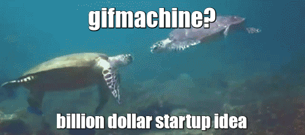

gifmachine
==========
*A Machine for Gifs*

- Need an excuse to show a gif to your coworkers? 
- Need a use for that Raspberry Pi that isn't doing anything useful?
- Need a web-scale solution to your animated gif needs?

Presenting the newest GMaaS (Gif Machine as a Service) solution for your tech company with a startup culture: **gifmachine**



What actually is it?
--------------------
- gifmachine is a Ruby Sinatra app that provides a dirty interface for enjoying gifs with your coworkers. gifmachine provides a HTTP API for posting gifs and meme text to overlay.
- gifmachine allows your coworkers to complain about `company_x`'s broken API when it goes down and laugh as [the internet catches fire](http://istheinternetonfire.com/).
- gifmachine is designed to be run in kiosk mode on an unused computer and monitor, it's just a webpage that puts the gif meme in fullscreen.

How does it work?
-----------------
It mostly does! When it is working well...
- gifmachine uses WebSockets to send out updates to connected clients.
- gifmachine stores everything in a database (developed with Postgres, but it shouldn't be too hard to change that).
- gifmachine uses ActiveRecord to save the developer time and calories.

WebSockets?
-----------


Okay I want this, what do?
----------
1. Get [RVM](http://rvm.io/rvm/install)
2. Using RVM, install Ruby 2.1.2 `rvm install 2.1.2`
3. Run `bundle install`
4. [If using Ubuntu Server 14.04 you might need to install `libpq-dev` for bundler to work](http://stackoverflow.com/a/6040822/831768)
5. `sudo -u postgres createuser -D -A -P gifmachine` and enter in a good password
6. `sudo -u postgres createdb -O gifmachine gifmachine` 
7. Change `config/database.yml` to reflect the username and password of your gifmachine database
8. `rake db:schema:load` to load the database schema into the database
9. Change the API password (:gifmachine_password) in app.rb to something else
10. `rackup`
11. Enjoy.


Uh, how do I post gifs?
-----------------------
Here's a relevant snippet of Ruby code that might help you interface with gifmachine's API:

```ruby
EventMachine::HttpRequest.new("#{@config.base_url}/gif", options).post :body => {
  :url => gif_url,
  :who => username,
  :meme_top => meme_top,
  :meme_bottom => meme_bottom,
  :seekrit => @config.password # Minimal security lololol
}
```